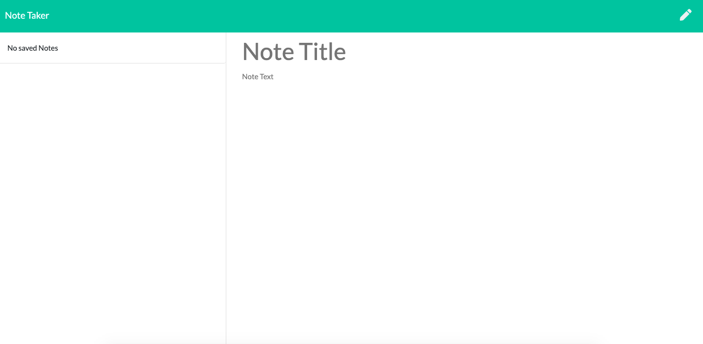

# note-taker-11

  
  

  
  
  # Description
  This is a full stack application using html/css/nodeJS and express. The application allows you to take notes into the pagewith a tittle,be able to save it and delete it as you please.
  # Table of Contents 
  * [Installation](#installation)
  * [Usage](#usage)
  * [License](#license)
  * [Contributing](#contributing)
  * [Tests](#tests)
  * [Questions](#questions)
  # Installation
  The following necessary dependencies must be installed to run the application properly: In order to use the application. You nned to clone this repository. Install all the dependecies using 'npm i'. Then run 'node server.js'which will send to localhost:3000 where you can use the application.
  # Usage
  ​This application is used for Click get started on the first page. On the second page select tittle, then write notes. You can use the icons on the top righ to save.
  # License
  This project is license under the MIT license.
  # Contributing
  ​Contributors: 
  # Tests
  To run tests, you need to run the following command: 
  # Questions
  If you have any questions about the repo, open an issue or contact undefined directly malcantar@gmail.com.